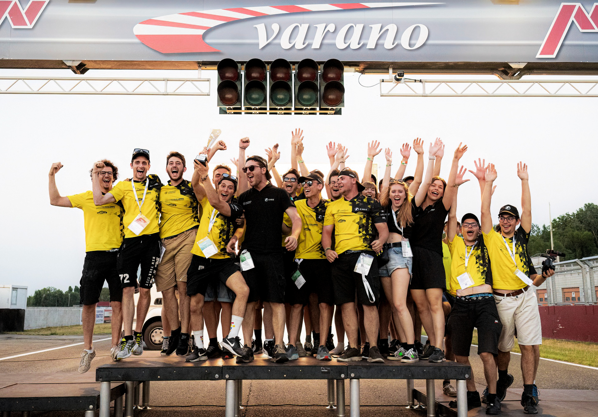
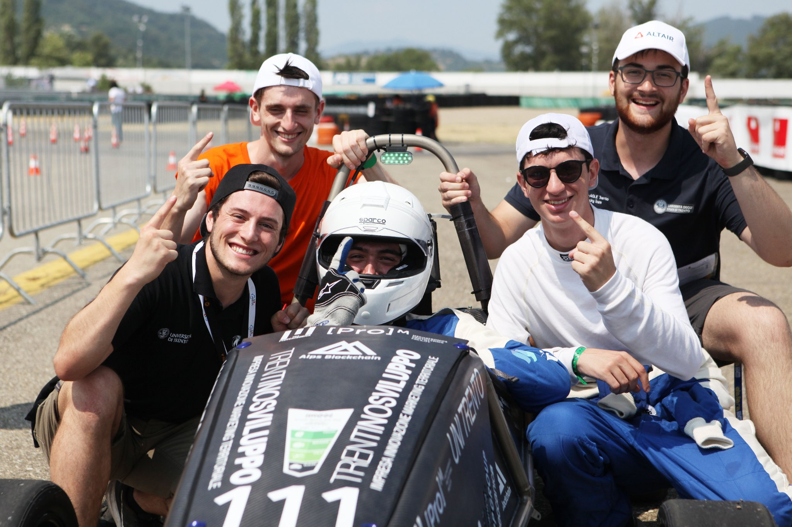
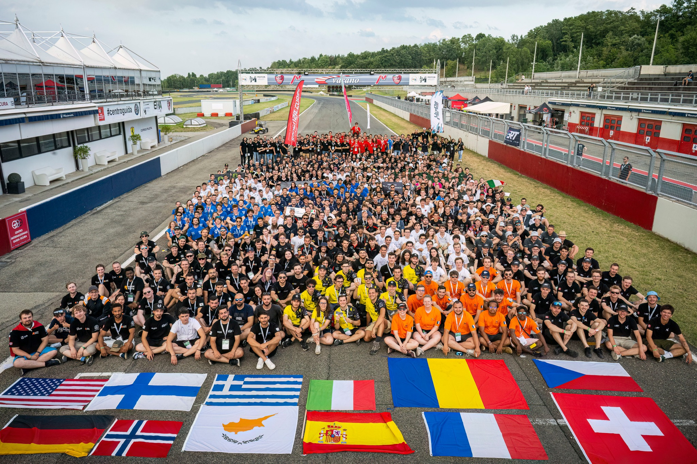
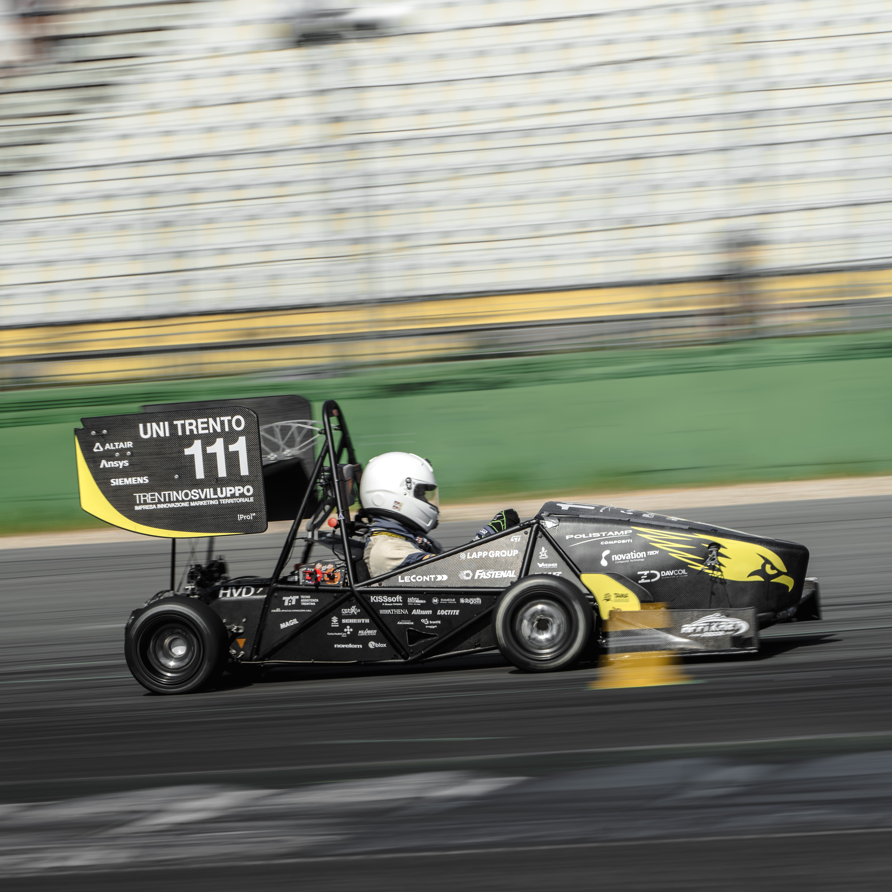
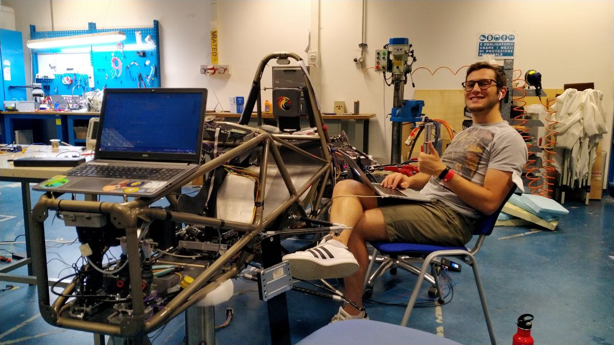
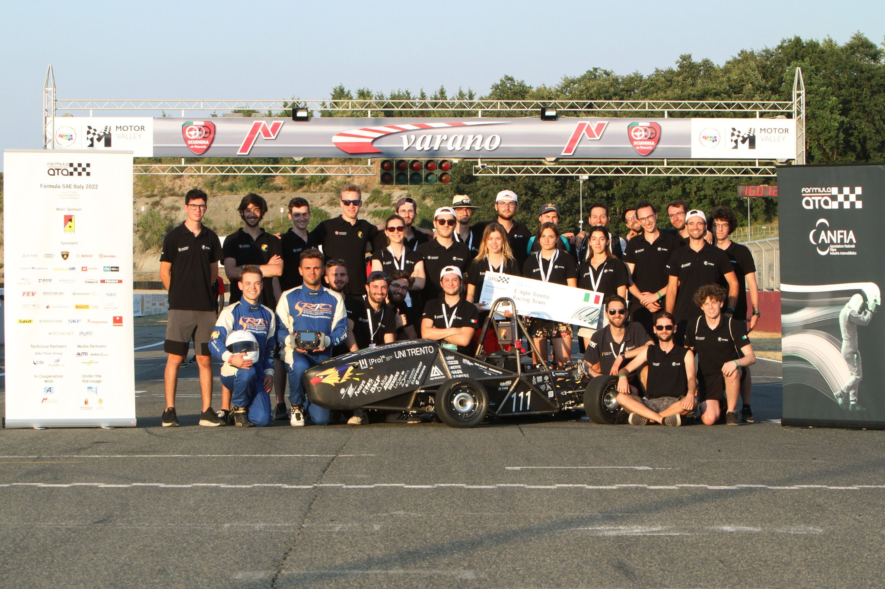

## Some thoughts about my experience in Formula Student (still WIP)

*For the moment just some pics*

  
  <figcaption>Team on podium for the "Most Friendly Team" Prize - Formula SAE Italy 2023</figcaption>



  
  <figcaption>Happiest moment during this experience - E-Agle TRT finishes the Endurance event for the first time of its history - Formula SAE Italy 2022</figcaption>



  
  <figcaption>Team with judges after Engineering Design Event - Formula SAE Italy 2023</figcaption>



  
  <figcaption>Formula Italy 2023 partecipant teams</figcaption>



  
  <figcaption>Team photo at the end of the competition - Formula Student Germany 2023</figcaption>



  
  <figcaption>Official team photo - Formula Student Germany 2023</figcaption>



  
  <figcaption>Fenice-EVO on FSG track - Formula Student Germany 2023</figcaption>



  
  <figcaption>Formula Student Germany 2023 partecipant teams</figcaption>



  
  <figcaption>Developing the firmware of Fenice's LV-BMS (2022)</figcaption>



  
<figcaption>Team photo at the end of the competition - Formula SAE Italy 2022</figcaption>



  
  <figcaption>Official team photo during seson 2021/22</figcaption>
